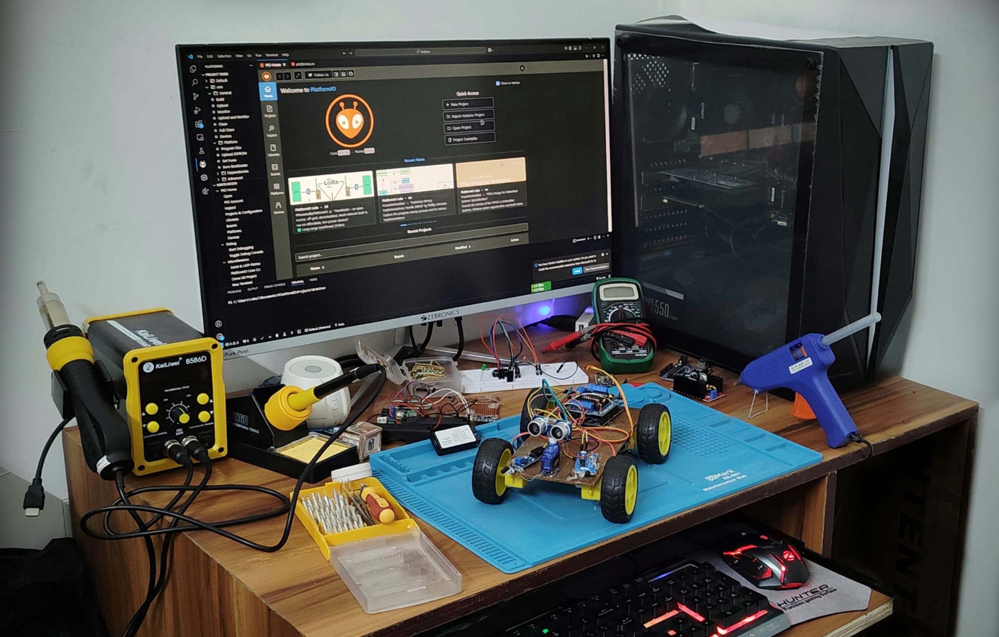

# 👋 Hello, I'm Rahul Morya!  

🎓 **Electronics Instrumentation** student at Dr. B.R. Ambedkar National Institute of Technology **(NIT)**, Jalandhar
🔍 Passionate about Embedded Systems, Drone/UAV, Robotics, and Hardware Development
💻 Web Developer & IoT Enthusiast with experience in building innovative projects
🛠️ Freelance Electronic Project Developer

---

## 🚀 Skills & Technologies  

### Programming  
- C/C++, Python, 8051 and 8085 assembly lamnguages, MATLAB  

### Web Development  
- React.js, Next.js, HTML, CSS, JavaScript  

### Embedded Systems  
- Microcontroller Programming (Arduino, ESP32, STM32)  
- RTOS: FreeRTOS  
- Communication Protocols: I2C, SPI, UART, CAN  
- Hardware Description Languages: Verilog  
- Tools: Multimeter, Logic Analyzers, JTAG, SMD Rework Station  

### Circuit Design & IoT  
- PCB Layout (Altium Designer, KiCAD)  
- IoT Platforms (Sinric Pro, AWS IoT, ESP8266)
- LTspice
  
### Operating System
- Windows
- Linux (Fedora, Ubuntu and Kali)

### Robotics
- ROS2
- RViz
---

## 🌟 Featured Projects  

### Real-Time Water Purity Monitoring System  
A project leveraging **Arduino** and **ESP8266** to measure and report water purity in real-time using various sensors.  

### Home Automation  
A smart home solution using **ESP8266** interfaced with appliances, controlled via the **Sinric Pro platform**.  

### ClinicConnect  
A **Clinic Management System** built with **React, Next.js, Express.js, and MongoDB**, enabling doctors and receptionists to manage patient data and prescriptions seamlessly.  

### Smart Vehicle Alcohol Detection System  
An IoT-based system using **Arduino** and **MQ3 Alcohol Sensor** to prevent drunk driving by disabling vehicle start functionality if alcohol is detected.  

---

## 📚 Education  

- **B. Tech in Electronics Instrumentation**  
  Dr. B.R. Ambedkar National Institute of Technology, Jalandhar (CGPA: 7.61)  

- **12th Grade**  
  Social Convent International School, Jalandhar - 1st Merit  

- **10th Grade**  
  Social Convent International School, Jalandhar - 1st Merit  

---

## 📫 Let's Connect!  

- **Email**: raahulmorya@gmail.com  
- **Phone**: +91-9478901150  
- **GitHub**: [github.com/raahulmorya](https://github.com/raahulmorya)  
- **LinkedIn**: [linkedin.com/in/rahulmorya](https://www.linkedin.com/in/rahulmorya)  

Feel free to reach out for collaborations, queries, or just to say hi! 😊  
